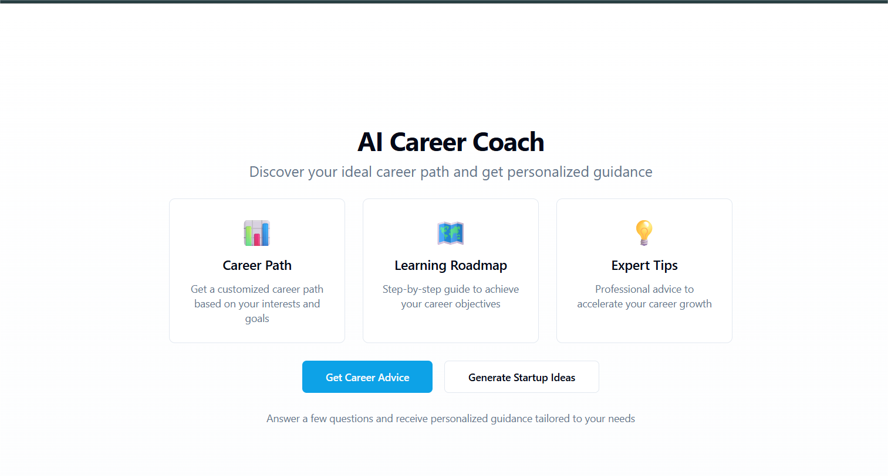
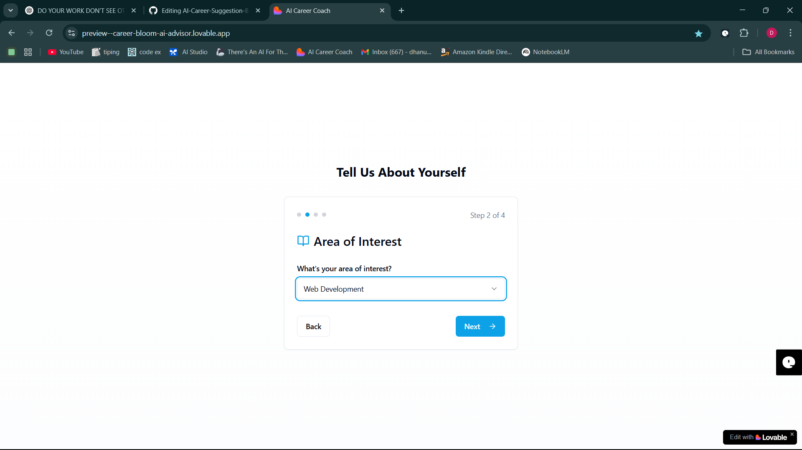
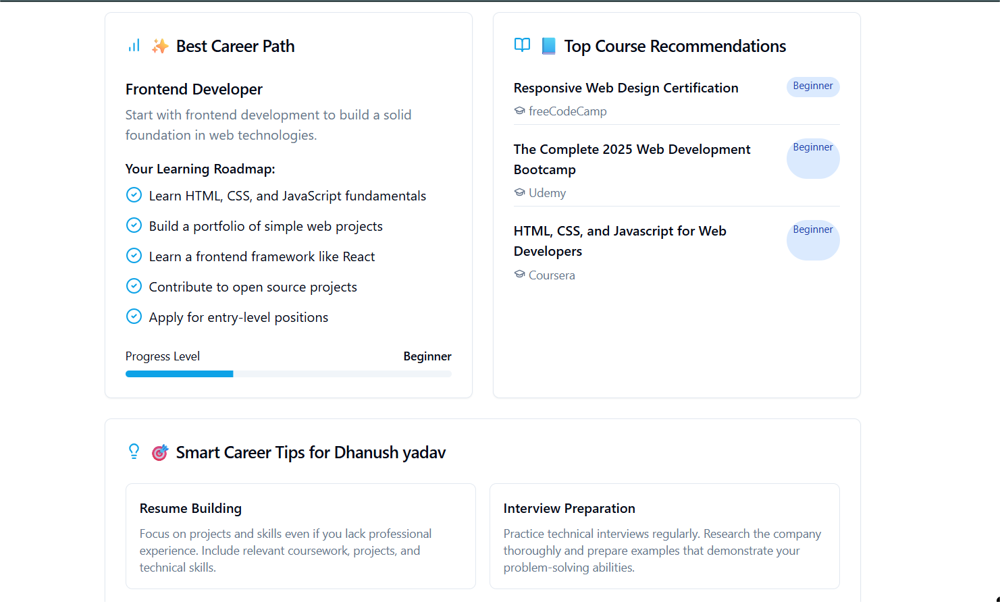

#  AI Career Suggestion Bot

An AI-powered chatbot built with [Lovable.ai](https://www.lovable.ai/) to help users discover the right career path based on their interests, skills, and goals.

---

# Overview
AI Career Suggestion Bot provides personalized career advice and learning resources for students and professionals. By leveraging AI, it delivers suggestions tailored to your interests, skill levels, and goals.

---

# Features
- Beginner / Intermediate / Advanced career filters
- Smart AI suggestions across various domains
- Personalized feedback based on your input
- Learning path & course recommendations
- Progress tracking *(coming soon)*

---

# Tech Stack
- Lovable.ai (No-code AI builder)
- GPT-based backend (via Lovable)
- Custom prompts and smart cards

---

# Live Demo
[Try it now](https://www.lovable.ai/) <!-- Replace with your actual demo link if available -->

---

# How to Use
1. Open the app on Lovable.ai.
2. Select your career level (Beginner, Intermediate, Advanced).
3. Enter your area of interest (e.g., Data Science, Web Development).
4. Get AI-generated guidance and learning resources.

---

# Screenshots

> Additional screenshots can be added in the `/screenshots` folder:
> - Main screen
> - Career suggestion screen

---

# Developer

**Name:** Dhanush Yadav  
**Role:** AI Explorer, Developer  
**Tool Used:** Lovable.ai  
**Guide:** ChatGPT (Devil)

---

# Contributing
Pull requests are welcome! For major changes, please open an issue first to discuss what you’d like to change.

---

# License

This project is open-source and free to use.
